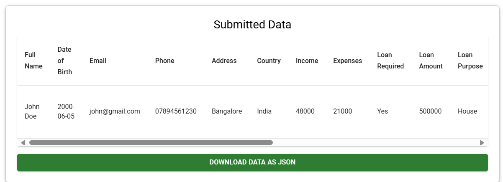

# Finance Client Details Form
This is a React-based web application that allows users to enter, manage, and view financial client details. The form captures various details such as income, expenses, assets, liabilities, loan requirements, and more. The data is stored in local storage and can be edited or deleted. Users can also download the submitted data as a JSON file.

## Features
- **User Form**: Collects financial information like income, expenses, loan details, etc.
- **Data Submission**: Stores form data locally in the browser.
- **Edit & Delete**: Allows users to edit or delete previously submitted data.
- **Data Download**: Users can download all submitted data in a JSON format.
- **Styled with Material UI**: The app's UI is designed using Material UI for responsiveness and flexibility.

## Technologies Used
- **React**
- **Material UI (MUI) for UI components**
- **Local Storage (to save data)**

## Screenshots

### Dashboard

